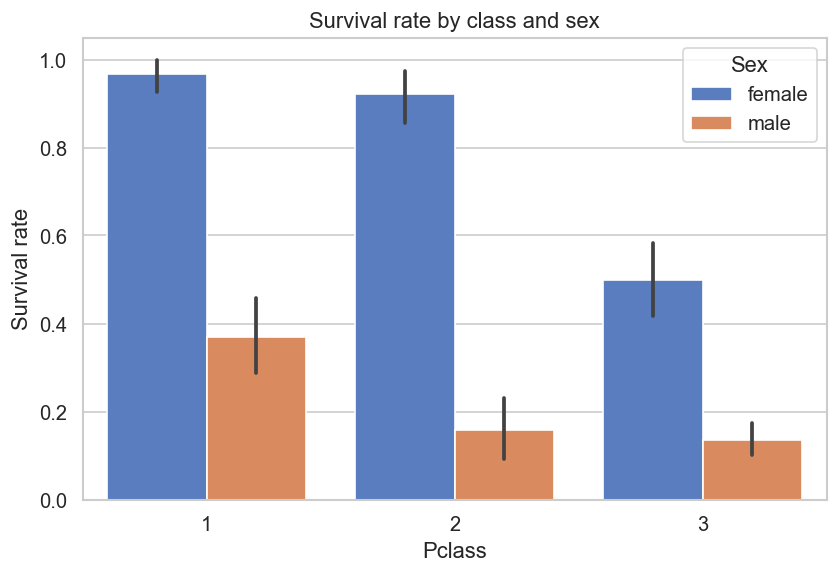
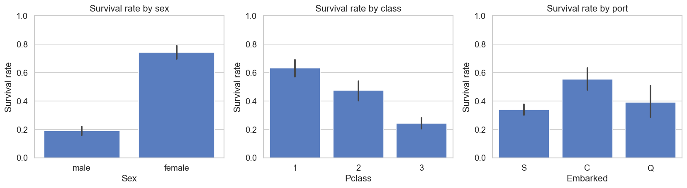
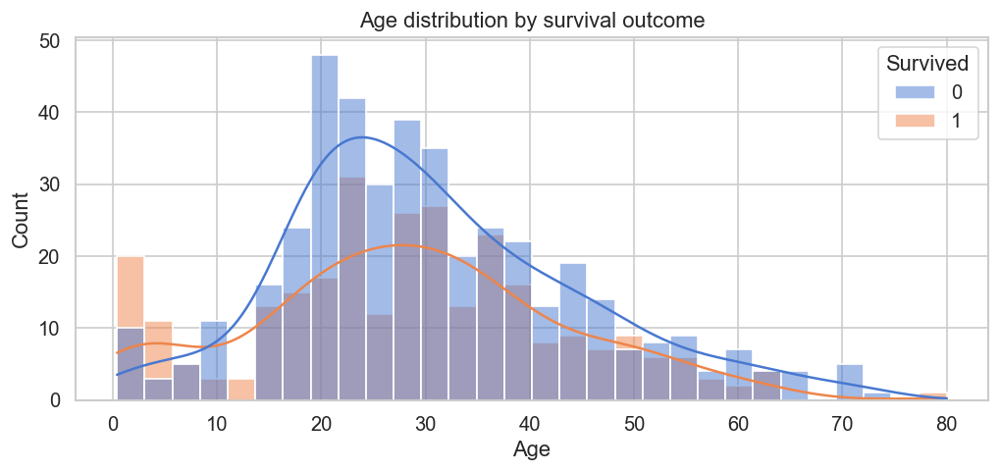

# 01 — Titanic: Exploratory Data Analysis

---

## The question

*What factors most strongly predicted survival on the Titanic — and can we find the story in the data before building a single model?*

This project is a deep exploratory analysis of the Titanic passenger dataset. The goal is not prediction — it is understanding. Before any ML model can be meaningful, you have to know your data inside out.

---

## Dataset

**Source:** [Kaggle — Titanic](https://www.kaggle.com/c/titanic/data)
**Size:** 891 rows x 12 columns (training set)

| Column | Description |
|--------|-------------|
| `Survived` | Target — 0 = No, 1 = Yes |
| `Pclass` | Passenger class (1st, 2nd, 3rd) |
| `Sex` | Male / Female |
| `Age` | Age in years (177 missing values) |
| `SibSp` | Siblings/spouses aboard |
| `Parch` | Parents/children aboard |
| `Fare` | Passenger fare |
| `Cabin` | Cabin number (687 missing) |
| `Embarked` | Port of embarkation — C, Q, S |

---

## Key findings


**Finding 1:** Women survived at ~74% vs ~19% for men — a gap driven by the
"women and children first" evacuation policy enforced by the crew.
**Finding 2:** 1st class passengers survived at ~63% vs ~24% for 3rd class —
wealth and deck proximity to lifeboats were life-or-death advantages.
**Finding 3:** Children under 10 had disproportionately high survival rates,
 while passengers aged 60+ had the worst outcomes of any age group.

---

## Visualizations

| Survival by class | Survival by sex | Age distribution |
|:-:|:-:|:-:|
|  |  |  |

---

## Notebook walkthrough

1. Data loading and first look
2. Missing value audit
3. Univariate analysis — distributions of each feature
4. Bivariate analysis — each feature vs survival
5. Multivariate — interaction effects
6. Key insights in plain English

Open the notebook: [notebook.ipynb](notebook.ipynb)

---

## How to run

```bash
cd eda-titanic
pip install -r requirements.txt
# Download train.csv from Kaggle and place in data/raw/
jupyter notebook notebook.ipynb
```

---

## What I learned

- Running my first real EDA taught me that understanding missingness matters before
  anything else — Cabin being 77% missing is a data quality issue, not just a gap to fill
- Seaborn's `hue` parameter revealed interaction effects I wouldn't have seen in a
  simple bar chart — sex and class together told a much richer story than either alone
- The port of embarkation appeared significant until I realized it was a proxy for
  passenger class — a reminder that correlation is not causation
- Gradient of survival across age groups showed "children first" was real in the data,
  not just a historical claim
---

## Tech stack


