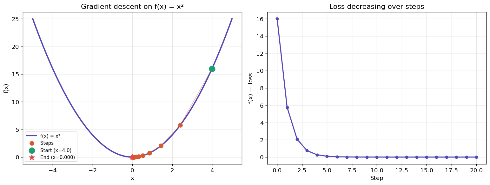
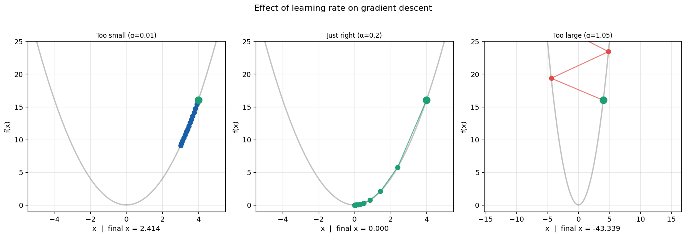
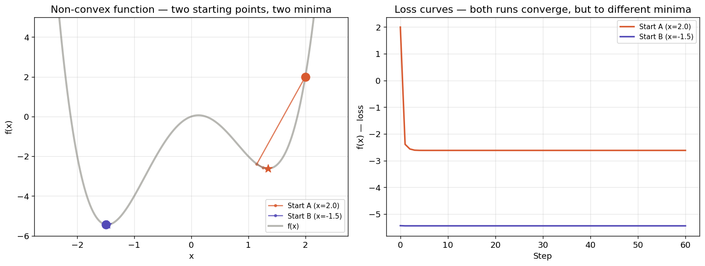
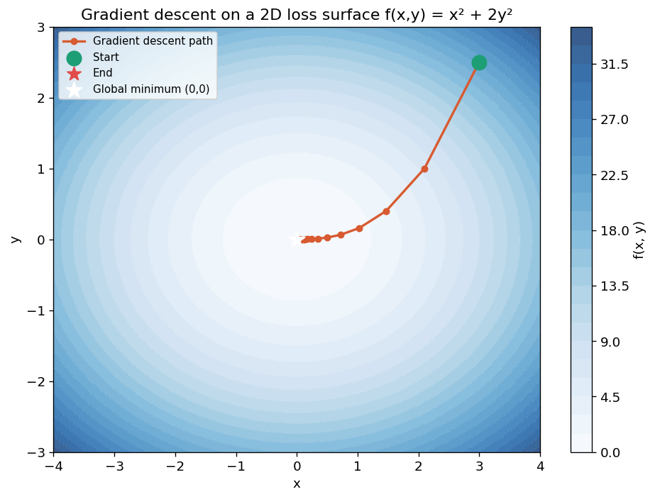

# 02 — Gradient Descent Visualizer

**Phase 1 · Project 2 of 2**

---

## The question

*What is gradient descent actually doing — and how does learning rate change everything?*

This notebook implements gradient descent from scratch using only NumPy, then visualizes every step with Matplotlib animations. No frameworks. No black boxes. Just math and code.

---

## What this demonstrates

- Gradient descent implemented from scratch (NumPy only, zero frameworks)
- Animated step-by-step visualization on 3 different loss functions
- Side-by-side comparison: learning rate too small vs just right vs too large (diverges)
- Plain English explanation of every line of math in the code

---

## Visualizations

| Descent on x² | Learning rate comparison |
|:-:|:-:|
|  |  |

| Non-convex — two local minima | 2D loss surface |
|:-:|:-:|
|  |  |

---

## The math — in plain English

The update rule:

```
x_new = x_old - learning_rate x gradient(x_old)
```

The gradient tells us which direction is "uphill". We subtract it to go downhill.
The learning rate controls how large each step is.

- Too small: takes forever to converge
- Just right: smooth descent to the minimum
- Too large: overshoots and diverges

---

## How to run

```bash
cd 02-gradient-descent-viz
pip install -r requirements.txt
jupyter notebook gradient_descent.ipynb
```

---

## What I learned

- A learning rate of 0.01 took tiny steps and barely moved in 25 steps — in a real 
  neural network this would mean training for days. A rate of 1.05 overshot the 
  minimum and the loss went UP instead of down.
- The non-convex experiment showed me that two starting points on the same function 
  can lead to completely different minima — this is why weight initialization in 
  neural networks is not random noise but a carefully designed strategy.
- The 2D surface showed the path curves instead of going straight — because the 
  gradient pulls harder in directions where the surface is steeper.
- This single update rule — x = x - lr × gradient — is the engine inside every 
  neural network ever trained, including GPT-4.

---

## Tech stack


